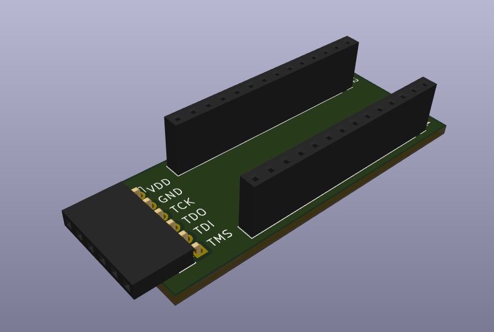
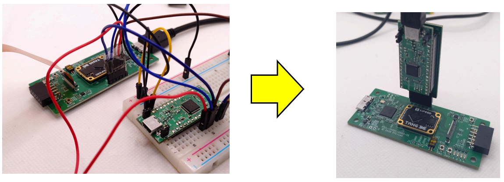

# FT232HLを JTAG 用に変換する基板

[English](README_en.md)

秋月電子さんの[FT232HL ハイスピードUSBシリアル変換モジュール](https://akizukidenshi.com/catalog/g/g106503/) を、JTAG 用に変換する基板を作りました。

主に拙作の [Tang Primer25K用USB3.0基板](https://github.com/ryuz/rtcl-tp25k-usb3-pcb) で利用することを想定しています。

一本づつ繋がなくて良くなるので、抜き差しがとても楽になります。

## 使い方

使用時の利便性を加味して、半田面にもシルク印刷していますので、コネクタを半田付けするときは表裏を間違えないように注意してください。

J1/J2/J3 などのリファレンスが印字されている側が部品面です。

FT232HL ハイスピードUSBシリアル変換モジュールは側は JP3 のみショートさせ、 **JP4は必ずオープンにしてください**。

JP4は I/O 電圧を供給するものですが、今回は接続先のボードから電圧を取るように設計しており、もし JP4 を繋ぐと FT232HL 側からも 3.3V電圧が供給されてしまい電源電圧の衝突で **ボードが壊れる可能性** があります。

## 免責事項

本設計データは、研究開発用の試作実験に用するものであり、利用に際して発生した如何なる損害も作者は補償いたしませんので予めご了承ください。

## ライセンス(License)

本設計データは、[クリエイティブ・コモンズ 表示-非営利 4.0 国際 ライセンス](https://creativecommons.org/licenses/by-nc/4.0/deed.ja)の下で提供されています。

製造した本基板の無断での販売や配布を行わない限りは、趣味や研究開発用途でご自由にお使いいただく事が出来ます。

また、商用に製造販売を希望される場合は、別途ライセンス契約を作者までご相談ください。[お問い合わせフォーム](https://rtc-lab.com/contact/)などからお問い合わせ頂けます。

## 作者情報

渕上 竜司(Ryuji Fuchikami)
[リアルタイムコンピューティング研究所](https://rtc-lab.com/)
